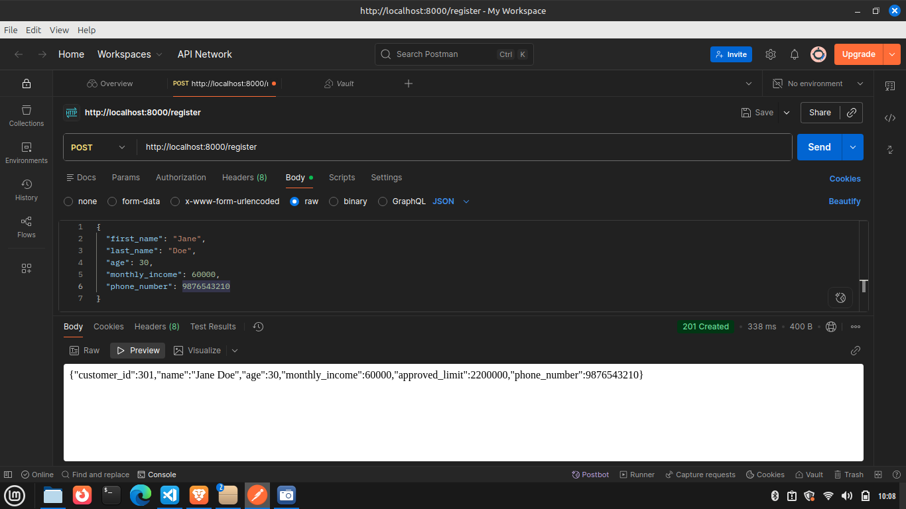
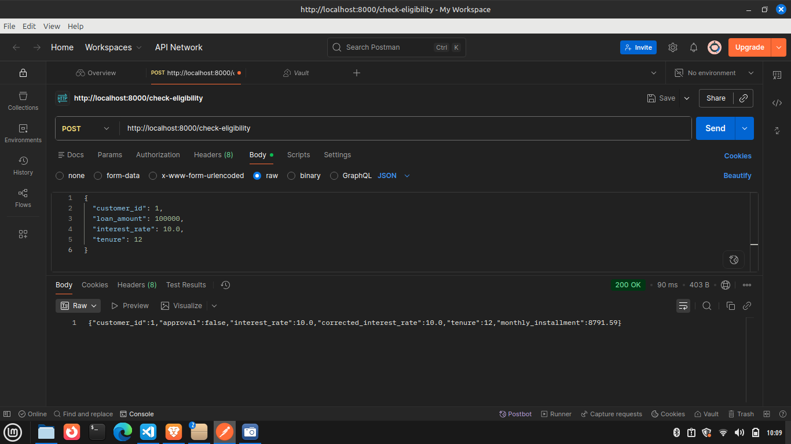
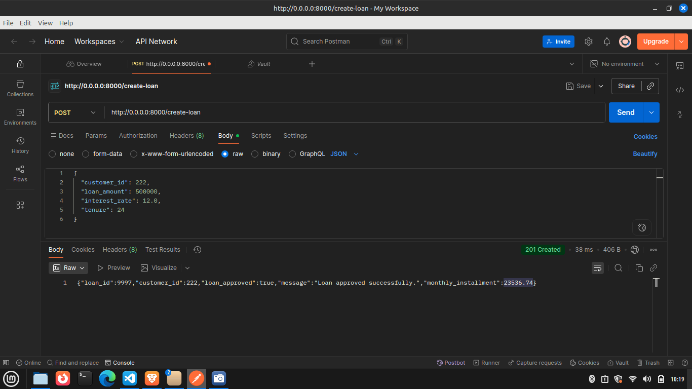

# Builded  Credit Approval System for Loan Apporval

A Django REST Framework backend for evaluating and processing customer loan applications based on historical credit data.

## Tech Stack Used in This Project

| Layer | Technology |
| Framework | Django 4.2 + Django REST Framework |
| Database | PostgreSQL 15 |
| Background tasks | Celery + Redis |
| Containerisation | Docker + Docker Compose |


# 1. Clone & place data files

Make sure `customer_data.xlsx` and `loan_data.xlsx` are present inside the `data/` directory at the project root

# 2. Run THIS

```bash
docker compose up --build
```
1. Start PostgreSQL and Redis
2. Run Django migrations
3. Ingest `customer_data.xlsx` and `loan_data.xlsx` synchronously 
4. Start the Django dev server on http://localhost:8000
5. Start a Celery worker 


## API Screenshots

### POST /register


### POST /check-eligibility


### POST /create-loan



# API Endpoints

### `POST /register`
Register a new customer. The approved credit limit is calculated as `36 × monthly_income`, rounded to the nearest lakh.

Request
```json
{
  "first_name": "Jane",
  "last_name": "Doe",
  "age": 30,
  "monthly_income": 60000,
  "phone_number": 9876543210
}
```

 Response`201 Created`
```json
{
  "customer_id": 305,
  "name": "Jane Doe",
  "age": 30,
  "monthly_income": 60000,
  "approved_limit": 2200000,
  "phone_number": 9876543210
}
```


### `POST /check-eligibility`
Check whether a customer qualifies for a loan based on their credit score (0–100).

- Past EMIs paid on time
- Number of historical loans
- Loan activity in the current year
- Total approved loan volume vs limit
- Current debt vs approved limit (score = 0 if exceeded)

Approval rules:
| Credit Score | Decision |
| > 50 | Approve at any rate |
| 30 – 50 | Approve if interest rate ≥ 12% |
| 10 – 30 | Approve if interest rate ≥ 16% |
| < 10 | Reject |
| Current EMIs > 50% salary | Reject |

**Request**
```json
{
  "customer_id": 1,
  "loan_amount": 500000,
  "interest_rate": 8.5,
  "tenure": 24
}
```

**Response** `200 OK`
```json
{
  "customer_id": 1,
  "approval": true,
  "interest_rate": 8.5,
  "corrected_interest_rate": 12.0,
  "tenure": 24,
  "monthly_installment": 23536.74
}
```
## `POST /create-loan`
Process and create a new loan if the customer is eligible. Uses compound interest for EMI calculation.

**Request**
```json
{
  "customer_id": 1,
  "loan_amount": 500000,
  "interest_rate": 12.0,
  "tenure": 24
}
```
**Response** `201 Created` (approved) / `200 OK` (rejected)
```json
{
  "loan_id": 6001,
  "customer_id": 1,
  "loan_approved": true,
  "message": "Loan approved successfully.",
  "monthly_installment": 23536.74
}
```

## `GET /view-loan/<loan_id>`
View full details of a specific loan including nested customer info.

**Response** `200 OK`
```json
{
  "loan_id": 5930,
  "customer": {
    "customer_id": 14,
    "first_name": "John",
    "last_name": "Doe",
    "phone_number": 9876543210,
    "age": 45
  },
  "loan_amount": "900000.00",
  "interest_rate": "8.20",
  "monthly_installment": "15344.00",
  "tenure": 129
}
```
### `GET /view-loans/<customer_id>`
List all **active** (not yet ended) loans for a customer.

**Response** `200 OK`
```json
[
  {
    "loan_id": 5930,
    "loan_amount": "900000.00",
    "interest_rate": "8.20",
    "monthly_installment": "15344.00",
    "repayments_left": 21
  }
]


## Running Tests##

## Background Ingestion via Celery##

To trigger async re-ingestion after startup:

```bash
docker compose exec web python manage.py ingest_data --async
```

The Celery worker will pick up `ingest_customer_data` and `ingest_loan_data` tasks 
